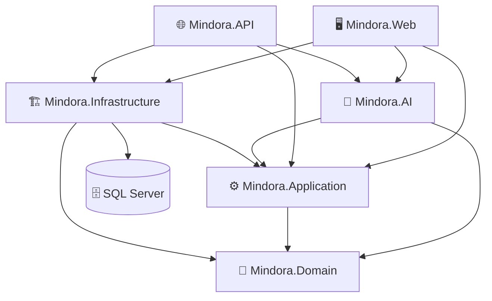

<div align="center">


### Recover. Reflect. Rebuild.

**AI-Powered Habit Recovery, Mental Wellness & Professional Support Platform**

A modular wellness technology platform engineered to bring together **habit recovery, self-reflection, wellness experiences, community support, professional services, analytics, and AI-oriented capabilities** within a structured .NET architecture.

<br>


[](https://dotnet.microsoft.com/)
[](https://learn.microsoft.com/dotnet/csharp/)
[](https://learn.microsoft.com/aspnet/core/)
[](https://learn.microsoft.com/ef/core/)
[](https://www.microsoft.com/sql-server)
[](https://getbootstrap.com/)
[](https://github.com/The-Musafir/Mindora)

<br><br>

> **A personal portfolio project showcasing ASP.NET Core, Clean Architecture, SignalR, and AI integration.**

[Explore Repository](https://github.com/The-Musafir/Mindora) • [Profile](https://github.com/The-Musafir) • [Report an Issue](https://github.com/The-Musafir/Mindora/issues)

</div>

---

## ℹ️ What is Mindora?

**Mindora** is a modular digital wellness platform built with **ASP.NET Core MVC, Clean Architecture, and modern .NET**.
The project is designed around a broader wellness ecosystem rather than a single-purpose application. Its domain model currently contains concepts covering:

- 🧠 Mental wellness & self-reflection
- 🔄 Habit recovery & habit tracking
- 📊 Assessments & results
- ✍️ Journaling & mood tracking
- 🤖 AI-oriented wellness experiences
- 👥 Community groups, posts, comments & reactions
- 🧑‍💼 Professional providers & services
- 📅 Appointments & availability
- 🔐 Security, privacy & audit concepts
- 📈 User and platform analytics
- 🔔 Notifications & preferences
- 🌱 Recovery resources

The repository is currently under **active development**.  
The presence of a domain entity or architectural component does **not** necessarily mean that the corresponding end-user feature is already complete.

---

## ✨ Product Vision

Mindora aims to create a calm, intelligent, and human-centered digital environment where users can move through a continuous cycle:

<div align="center">

### 🧠 Mind
Understand your patterns.
**↓**
### 🔎 Reflect
Observe and record your experiences.
**↓**
### 🔄 Recover
Build healthier habits and recovery routines.
**↓**
### 🌱 Rebuild
Develop sustainable progress over time.

</div>

The product direction intentionally combines **human-centered wellness experiences** with a professionally structured software architecture.

---

# 🧩 Core Capability Areas

<table>
<tr>
<td width="50%" valign="top">

### 🧠 Mental Wellness
Domain models currently cover assessment questionnaires, questions, options, results, user assessments, and wellness resources.

</td>
<td width="50%" valign="top">

### 🔄 Habit Recovery
Mindora contains domain models for habits, goals, milestones, and tracking entries, providing the foundation for structured habit-recovery workflows.

</td>
</tr>
<tr>
<td width="50%" valign="top">

### ✍️ Journaling & Reflection
The domain includes journal entries, moods, tags, and journal-entry tagging concepts for personal reflection experiences.

</td>
<td width="50%" valign="top">

### 🤖 AI-Oriented Architecture
A dedicated `Mindora.AI` project exists alongside AI-related domain entities such as chat messages and wellness coach sessions.

</td>
</tr>
<tr>
<td width="50%" valign="top">

### 👥 Community
The domain currently models community groups, members, posts, comments, reactions, and moderation concepts.

</td>
<td width="50%" valign="top">

### 🧑‍💼 Professional Support
Professional providers, services, specialties, availability slots, practice details, verification documents, reviews, and appointments are represented in the domain model.

</td>
</tr>
<tr>
<td width="50%" valign="top">

### 🔐 Privacy & Security
The architecture includes security settings, refresh-token concepts, audit logs, privacy requests, roles, and user-role relationships.

</td>
<td width="50%" valign="top">

### 📊 Analytics & Notifications
The domain includes user analytics snapshots, platform analytics events/snapshots, dashboard metrics, notification templates, and user notification preferences.

</td>
</tr>
</table>

---

# 🎯 Current Engineering Direction

Mindora is being developed as a **modular .NET application** with clear separation between domain concepts, application contracts, infrastructure, AI capabilities, API boundaries, and web presentation.

The current repository contains:

```text
Mindora
│
├── Mindora.Domain
│   └── Core business entities and domain concepts
│
├── Mindora.Application
│   └── Application contracts and repository abstractions
│
├── Mindora.Infrastructure
│   └── Persistence, EF Core, repositories and database configuration
│
├── Mindora.AI
│   └── Dedicated AI architectural layer
│
├── Mindora.API
│   └── HTTP/API application boundary
│
└── Mindora.Web
    └── ASP.NET Core MVC web presentation
```

---

## 🏗️ Architecture

Mindora is organized as a multi-project .NET solution with explicit separation between the domain, application abstractions, infrastructure, AI boundary, API, and web presentation layers.

### System Dependency Graph



### 🧩 Clean Architecture Layers

| Layer | Responsibility |
| :--- | :--- |
| 🧩 **Domain** | Core business entities and domain concepts |
| ⚙️ **Application** | Repository contracts and application-level abstractions |
| 🏗️ **Infrastructure** | Persistence, EF Core, SQL Server, repositories, configurations and migrations |
| 🤖 **AI** | Dedicated AI-oriented architectural boundary |
| 🌐 **API** | HTTP/API application boundary |
| 🖥️ **Web** | User-facing ASP.NET Core MVC presentation |

---

### 🔗 Verified Project Dependencies

| Project | Project References |
| :--- | :--- |
| `Mindora.Domain` | — |
| `Mindora.Application` | `Mindora.Domain` |
| `Mindora.Infrastructure` | `Mindora.Application`, `Mindora.Domain` |
| `Mindora.AI` | `Mindora.Application`, `Mindora.Domain` |
| `Mindora.API` | `Mindora.AI`, `Mindora.Application`, `Mindora.Infrastructure` |
| `Mindora.Web` | `Mindora.AI`, `Mindora.Application`, `Mindora.Infrastructure` |

---

# 🗄️ Data Architecture

The repository contains a dedicated persistence architecture using Entity Framework Core and SQL Server.

```text
                  DOMAIN ENTITIES
                         │
                         ▼
               ENTITY CONFIGURATIONS
                         │
                         ▼
                  MindoraDbContext
                         │
                         ▼
               Entity Framework Core
                         │
                         ▼
                    SQL Server
```

## Persistence Components

```text
Mindora.Infrastructure/
│
├── Configurations/
│
├── Migrations/
│
├── Persistence/
│   ├── DbContext/
│   │   └── MindoraDbContext.cs
│   │
│   └── SeedData.cs
│
└── Repositories/
    ├── GenericRepository.cs
    ├── RoleRepository.cs
    ├── UnitOfWork.cs
    └── UserRepository.cs
```

The repository contains an EF Core migration history including:
- `InitialCreate`
- `FixCascadeDeleteAndPendingChanges`
- `RemoveCascadeDelete`

---

## 🛠️ Technology Stack

<table>
<tr>
<td width="50%" valign="top">

### Backend
- .NET 10
- ASP.NET Core
- C#
- ASP.NET Core MVC

### Architecture
- Clean Architecture principles
- Dependency Injection
- Repository abstractions
- Generic Repository
- Unit of Work

</td>
<td width="50%" valign="top">

### Database
- Microsoft SQL Server
- Entity Framework Core
- EF Core SQL Server provider
- EF Core migrations
- Entity configurations

### Frontend
- Razor Views
- HTML / CSS / JavaScript
- Bootstrap
- jQuery

</td>
</tr>
<tr>
<td width="50%" valign="top">

### AI
- Dedicated `Mindora.AI` project
- AI domain models
- AI architectural boundary

</td>
<td width="50%" valign="top">

### API
- ASP.NET Core
- OpenAPI support
- Dedicated API project

</td>
</tr>
</table>

---

# 📁 Repository Structure

```text
Mindora/
│
├── .gitignore
├── LICENSE
├── README.md
├── Mindora.slnx
│
├── mindora-bootstrap.ps1
├── setup_mindora_folders.ps1
│
└── src/
    │
    ├── Mindora.Domain/
    │   ├── Entities/
    │   │   ├── AIChatMessage.cs
    │   │   ├── AIWellnessCoachSession.cs
    │   │   ├── Appointment.cs
    │   │   ├── Assessment*.cs
    │   │   ├── BoredomRecovery*.cs
    │   │   ├── Community*.cs
    │   │   ├── Habit*.cs
    │   │   ├── Journal*.cs
    │   │   ├── ProfessionalProvider.cs
    │   │   ├── Provider*.cs
    │   │   ├── User*.cs
    │   │   ├── WellnessResource*.cs
    │   │   └── ...
    │   │
    │   └── Mindora.Domain.csproj
    │
    ├── Mindora.Application/
    │   ├── Interfaces/
    │   │   └── Repositories/
    │   │       ├── IGenericRepository.cs
    │   │       ├── IRoleRepository.cs
    │   │       ├── IUnitOfWork.cs
    │   │       └── IUserRepository.cs
    │   │
    │   └── Mindora.Application.csproj
    │
    ├── Mindora.Infrastructure/
    │   ├── Configurations/
    │   ├── Migrations/
    │   ├── Persistence/
    │   │   ├── DbContext/
    │   │   │   └── MindoraDbContext.cs
    │   │   └── SeedData.cs
    │   ├── Repositories/
    │   │   ├── GenericRepository.cs
    │   │   ├── RoleRepository.cs
    │   │   ├── UnitOfWork.cs
    │   │   └── UserRepository.cs
    │   └── Mindora.Infrastructure.csproj
    │
    ├── Mindora.AI/
    │   └── Mindora.AI.csproj
    │
    ├── Mindora.API/
    │   ├── Program.cs
    │   ├── Mindora.API.http
    │   ├── Properties/
    │   ├── appsettings.json
    │   ├── appsettings.Development.json
    │   └── Mindora.API.csproj
    │
    └── Mindora.Web/
        ├── Controllers/
        │   └── HomeController.cs
        ├── Models/
        ├── Views/
        ├── wwwroot/
        │   ├── css/
        │   ├── js/
        │   └── lib/
        ├── Program.cs
        ├── appsettings.json
        ├── appsettings.Development.json
        └── Mindora.Web.csproj
```

---

# 📊 Development Status

<div align="center">

### 🟠 ACTIVE DEVELOPMENT
Mindora is an actively evolving collaborative engineering project.

</div>

| Area | Status |
| :--- | :---: |
| Solution architecture | 🟢 Established |
| Domain model | 🟢 Established |
| Entity configurations | 🟢 Established |
| EF Core persistence | 🟢 Established |
| SQL Server integration | 🟢 Established |
| Repository layer | 🟢 Established |
| Unit of Work | 🟢 Established |
| Database migrations | 🟢 Present |
| AI project boundary | 🟢 Established |
| API implementation | 🟠 In Development |
| Web application | 🟠 In Development |
| Complete user workflows | 🟠 In Development |
| Production deployment | ⚪ Planned |

> **Repository evidence rule:** A modeled entity or project boundary is not automatically considered a completed end-user feature. Feature completion is determined by the implementation of its workflows, services, endpoints, and UI.

---

# 🗺️ Roadmap

```text
                     MINDORA ROADMAP

        ┌──────────────────────────────┐
        │          FOUNDATION          │
        │                              │
        │  ✓ Solution Architecture     │
        │  ✓ Domain Model              │
        │  ✓ Persistence Foundation    │
        │  ✓ EF Core Migrations        │
        └──────────────┬───────────────┘
                       │
                       ▼
        ┌──────────────────────────────┐
        │         APPLICATION          │
        │                              │
        │  ◐ API Development           │
        │  ◐ Web Development           │
        │  ◐ User Workflows            │
        └──────────────┬───────────────┘
                       │
                       ▼
        ┌──────────────────────────────┐
        │           PLATFORM           │
        │                              │
        │  ○ AI Experiences            │
        │  ○ Habit Recovery            │
        │  ○ Community                 │
        │  ○ Professional Support      │
        │  ○ Analytics                 │
        └──────────────┬───────────────┘
                       │
                       ▼
        ┌──────────────────────────────┐
        │          PRODUCTION          │
        │                              │
        │  ○ Security Hardening        │
        │  ○ Deployment                │
        │  ○ Production Release        │
        └──────────────────────────────┘
```

**Legend:**
- `✓` Completed / established
- `◐` In progress
- `○` Planned

---

# 🔀 Git & Team Workflow

Mindora is being developed collaboratively through Git branches.

### Development Flow

```text
feature/* ──> develop ──> main
```

### Current Repository Branches
- `main`
- `develop`
- `frontend`
- `backend`
- `database`
- `ai`

### Branch Responsibilities

| Branch | Purpose                                    |
| :---       | :---                                   |
| `main`     | Stable branch                          |
| `develop`  | Primary integration/development branch |
| `frontend` | Frontend-focused development branch    |
| `backend`  | Backend-focused development branch     |
| `database` | Database-focused development branch    |
| `ai`       | AI-focused development branch          |

##For new isolated features, the preferred conceptual flow is:

```text
develop ──> feature/<feature-name> ──> develop ──> main
```

---

# ⚡ Getting Started

### Prerequisites

Before running Mindora locally, ensure you have installed:
- [.NET 10 SDK](https://dotnet.microsoft.com/)
- [Microsoft SQL Server](https://www.microsoft.com/sql-server)
- [Git](https://git-scm.com/)
- A compatible IDE/editor (Visual Studio 2022+, JetBrains Rider, or VS Code)

Verify .NET installation:
```bash
dotnet --version
```

### 1. Clone
```bash
git clone https://github.com/The-Musafir/Mindora.git
cd Mindora
```

### 2. Restore
```bash
dotnet restore Mindora.slnx
```

### 3. Build
```bash
dotnet build Mindora.slnx
```

### 4. Configure Database
Update the connection strings in the configuration files according to your local environment:
- `src/Mindora.API/appsettings.Development.json`
- `src/Mindora.Web/appsettings.Development.json`

### 5. Apply Database Migrations
Run the EF Core migrations to prepare your local SQL Server instance:
```bash
dotnet ef database update \
  --project src/Mindora.Infrastructure/Mindora.Infrastructure.csproj \
  --startup-project src/Mindora.Web/Mindora.Web.csproj
```

### 6. Run Web Presentation
```bash
dotnet run --project src/Mindora.Web/Mindora.Web.csproj
```

### 7. Run API Service
```bash
dotnet run --project src/Mindora.API/Mindora.API.csproj
```

---

# 🔐 Configuration & Security

Mindora uses environment-specific ASP.NET Core configurations (`appsettings.json`, `appsettings.Development.json`).

### ❌ Never Commit Secrets
Do **not** commit:
- API keys or tokens
- Passwords & private credentials
- Auth secrets
- Production connection strings

Prefer environment variables or [.NET User Secrets](https://learn.microsoft.com/aspnet/core/security/app-secrets) for local development.

---

# 🧪 Development Principles

- **Separation of Concerns:** Each layer and project has an explicit, isolated responsibility.
- **Dependency Direction:** The core domain is completely independent of infrastructure and UI concerns.
- **Persistence Isolation:** Database access and EF Core configurations stay strictly inside `Mindora.Infrastructure`.
- **Extensibility:** AI interfaces and logic remain modular within `Mindora.AI` to evolve independently.
- **Modular Collaboration:** Clean feature branching keeps backend, frontend, database, and AI tracks parallel and unblocked.

---

# 👨‍💻 Author

<div align="center">

**MD. Habibur Rahman**

Backend · AI · Database · Clean Architecture

[](https://github.com/The-Musafir)

</div>

---

# 📜 License

This repository contains a `LICENSE` file. Refer to `LICENSE` for the project's applicable licensing terms.

---

<div align="center">

### 🧠 MINDORA
**Recover · Reflect · Rebuild**

<br>


<br><br>

[](https://github.com/The-Musafir/Mindora)

<br><br>

**Mindora — A Personal Engineering Project**

<sub>Recover. Reflect. Rebuild.</sub>

</div>
